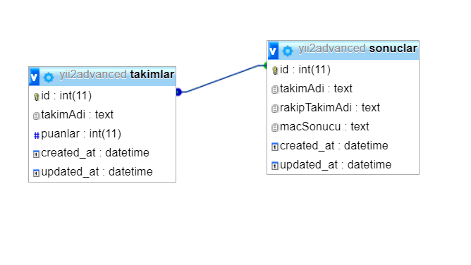
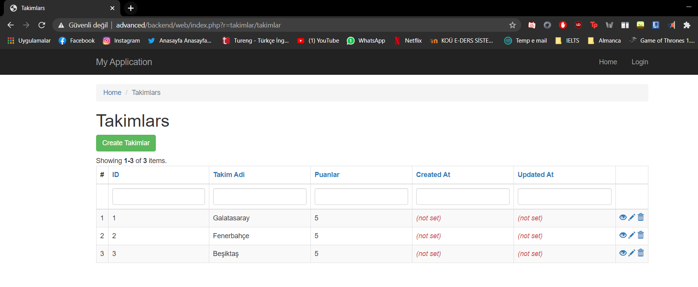
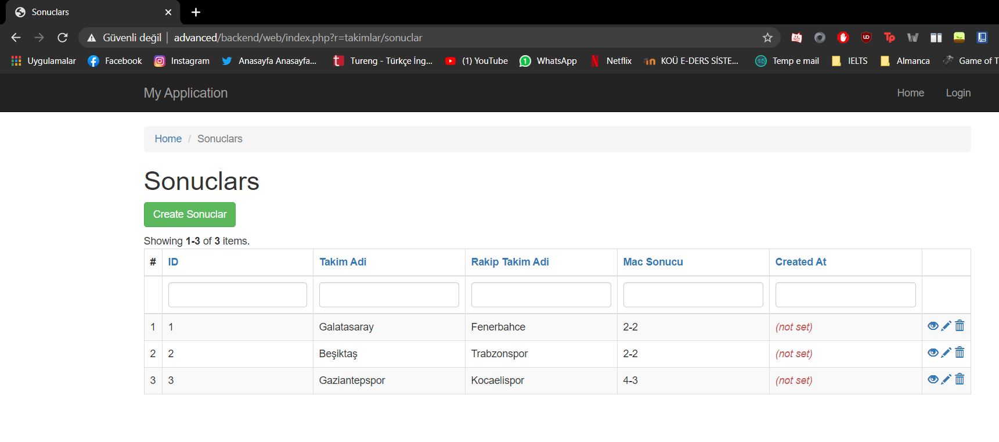

# yii2-takimlar

Futbol takımları ve maç sonuçları modülü

Hazırlayan:
170201110 - Muhammet Furkan Doğruer

# Hakkında

Bu modül aracılığıyla futbol takımlarının tablo sıralamaları ve maç sonuçları tutulmaktadır.

# Kurulum

Modül kurulumu vagrant ve yii2-advanced template'i üzerinden anlatılacaktır. Modül kurulumu için öncelikle vagrant üzerinde çalışan yii2-advanced kurulumunu gerçekleştiriniz.

ssh veya vagrant ssh ile vagrant üzerinde yii projenizin ana dizinine gidiniz.(Örneğin /var/www/advanced)
(Örnek ssh bağlantısı: "ssh -i .\.vagrant\machines\makineAdi\virtualbox\private_key vagrant@advanced" )

PHP 7 sürümlerinden birini gerektirir. Tüm modüllerin düzgün kurulması için advanced projesi kurulumundan sonra önce şu iki komutla proje başlatılmalıdır:
```
php requirements.php
php init
```
daha sonra
```
 composer require --prefer-dist furkandogruer/yii2-takimlar "dev-main"
 ```

 komutu ile packagist üzerinden modül kurulumunu gerçekleştiriniz.
    
Daha sonrasında yii projenizin ana dizininde backend\config\main.php dosyasını düzenlemek için açınız. Aşağıda gösterildiği şekilde düzenlemeyi yapınız.

```
   'modules' => [
        'takimlar' => [
           'class' => 'furkandogruer\takimlar\Module'
        ]
    ],
 ```


Modülün çalışabilmesi için son olarak migration işleminin gerçekleştirilmesi gereklidir.

Projede tanımlı isme sahip bir veritabanınız olduğunu doğrulayın ve daha sonra aşağıdaki komutla projenizin ana tablolarını yükleyin:


ssh bağlantısı ile vagrant üzerinde kurmuş olduğunuz makinenin proje ana dizinindeyken alttaki komutlar çalıştırılmalıdır.

Projede tanımlı isme sahip bir veritabanınız olduğunu doğrulayın ve daha sonra aşağıdaki komutla projenizin ana tablolarını yükleyin:

```
php yii migrate
 ```
daha sonra aşağıdaki komut ile modülde bulunan veritabanının ana tablolarının migration işlemi tamamlanmış olacak.
```
    php yii migrate/up --migrationPath=@vendor/furkandogruer/yii2-takımlar/src/console/migrations
 ```

 Artık migration işlemimiz gerçekleştirilmiştir. Modülümüz çalışır hale gelmiştir.

 Modülü test etmek için tarayıcınızda 

```
    http://alanadi/backend/web/index.php?r=takimlar/takimlar
    
    ve 
    
    http://alanadi/backend/web/index.php?r=takimlar/sonuclar
```
 adreslerine gidiniz. Modüle ait "Takımlar" ve "Sonuçlar" tablolarını görüntülemiş olacaksınız.
 
 Not: Modülün geliştirilmesi sırasında advanced template'inin altında backend üzerinde kurulmuştur. "alanadi/frontend/web/..." şeklinde giriş yapılırsa modüller ekrana gelmeyecektir.

## Migrations

Modül içerisindeki migration dosyasında modül içerisinde kullanılacak 2 adet tablo oluşturulmuştur. Tablolar arasında foreign key ile ilişki kurulmuştur ve anahtar değerler için indekslemeler yapılmıştır. Takımlar ve Sonuçlar için 2 adet tablo bulunmaktadır. Tablolar arasındaki ilişki aşağıda gösterildiği şekildedir. 1 adet foreign key kullanılmıştır.





# Modülün "Takımlar" sayfası aşağıdaki gibidir.




# Modülün "Sonuçlar" sayfası aşağıdaki gibidir.




